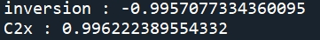
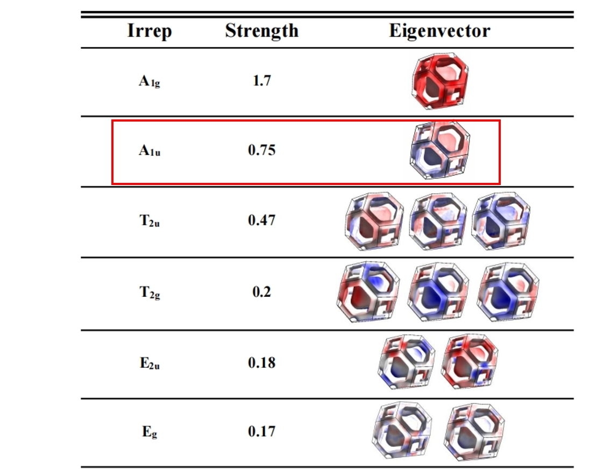

# **Use of documentation of different pairing channels calculation of Pb**
Here I will introduce how to use the codes in this directory to calculate the different superconductivity pairing channels of Pb base on QE+epw data. 
## **Directory structure**
```text
Project Directory
├── cal_delta.py         # main function：resolve different pairing channels by direct diagonalization method (DDM)
├── irrep_delta.py       # determine the symmetry of s selected pairing channel
├── epw_calculation/     # the input file of QE+EPW to generate EPC data for DDM analysis
│   ├── scf.in           # the input file of self-consistent calculation
│   ...
│   └── Readme.md        # instructions for running QE
├── result/              # sample output data of cal_delta.py and irrep_delta.py
│   ├── delta/           # the output of `cal_delta.py`
│   │   ├── dkki-x.txt    # the eigenvector of the xth i-parity eigenvector of interaction matrix
│   │   ... 
│   └── pbt-3.frmsf   # the output of `irrep_delta.py`
└──────────────────────────────────────────────────────────────────────────────────────────────────────────────────────────────────
```
## **Input and output files of `cal_delta.py` and `irrep_delta.py`**
### **1.`cal_delta.py`**
- **Input files**：` pb.lambda_kkq` and `pb.lambda_FS`
- **Output files**: `delta/` directory

### **2.`irrep_delta.py`**
- **Input files**：`delta/` directory ,` pb.bxsf`, `pb.lambda_FS` and `wfc.dat`
- **Output files**: `pbt-3.frmsf`
## **Calculation Process**
### **1.QE+EPW calculation**
First we should get the following data from QE+EPW:
```bash
electron phonon coupling data and smearing weight data: pb.lambda_kkq; 
electron structure near fermi_surface: pb.lambda_FS; 
electron structure data: pb.bxsf;  
wavefunction data: wfc.dat 
```

#### **format of the files**
##### **pb.lambda_kkq**
The variables of each column:
| `ik`  | `Ek`  | `ikq` | `Ekq` | `ibnd` | `jbnd` | `gkk(ik, ibnd, ikq, jbnd, imode).real` | `gkk(ik, ibnd, ikq, jbnd, imode).imag`| `wf(q, imode)` | `weight0(ik, ibnd)` | `weight1(ik, ibnd)` | `weight1(ikq, jbnd)` |
|-------|-------|-------|-------|--------|--------|--------------------------|-----------------|---------------------|---------------------|--------------------|--------------------|


variable meaning:
| **column**          | **discribution**                                  |
|-------------------|-------------------------------------------|
| `ik,ikq`              | momentum index  |
| `ibnd,jbnd`            | band index                              |
| `Ek(ik,ibnd), Ekq(ikq,jbnd)`     | electron energy (relative to Fermi energy)             |
| `imode`             | phonon branch index              |          |
| `gkk(ik, ibnd, ikq, jbnd, imode).real; gkk(ik, ibnd, ikq, jbnd, imode).imag` | real and imaginary parts of electron-phonon coupling matrix element  |
| `wf(q, imode)`    | phonon frequency  |
| `weight0(ik, ibnd), weight0(ikq, jbnd)` | smearing weight of a state given by the derivative of the 0th-order Methfessel-Paxton function (c.f. `qe/Modules/w0gauss.90`)                                        |
| `weight1(ik, ibnd), weight1(ikq, jbnd)` | smearing weight of a state given by the derivative of the 1th-order Methfessel-Paxton function (c.f. `qe/Modules/w0gauss.90`)                                        |

##### **pb.lambda_FS**
The variables of each column:
| `kx`  | `ky`  | `kz` | `ik` | `ikk` | `-kx` | `-ky` | `-kz` | `ibnd` | `Ek`|
|-------|-------|------|------|-------|-------|-------|-------|--------|-----|

variable meaning:
| **column**          | **discribution**                                  |
|-------------------|-------------------------------------------|
| `kx,ky,kz`              | momentum components in fractional coordinates  |
| `ik`              | momentum index of (kx,ky,kz)  |
| `ikk`              | momentum ondex of (-kx, -ky ,-kz)  |
| `-kx,-ky,-kz`              | momentum components in fractional coordinates   |
| `ibnd`            | band index                              |
| `Ek(ik,ibnd)`     | electron energy (relative to Fermi energy)             |

##### **wfc.dat**
The variables of each column:
| `ik`  | `ibnd`  | `wannier-index` | `weight.real` | `weight.imag` |
|-------|---------|-----------------|---------------|---------------|

variable meaning:
| **column**          | **discribution**                                  |
|-------------------|-------------------------------------------|
| `ik`              | momentum index  |
| `ibnd`              | band index  |
| `wannier-index`            | index of wannier basis                              |
| `weight.real` , `weight.real`      | real and imaginary parts of wavefunction weights in wannier basis             |

Sample files can be downloaded from [https://cloud.tsinghua.edu.cn/d/168a78a095d54d5d8865/].

### **2.Calculate different pairing channel of Pb**
run the `cal_delta.py` code

```bash
 ./cal_delta.py
```

this code generates the `delta/` directory; the `delta/dkki-x.txt` saved the xth i-parity eigenvector of interaction matrix. This version of code has not been well optimized, such that this step may take several hours.

Sample output files can also be downloaded from [https://cloud.tsinghua.edu.cn/d/168a78a095d54d5d8865/].

### **3.Symmetry determination and eigenvector plot**
Run `irrep_delta.py` to analyze the representation of a selected eigenvector and output the `.frmsf` file

```bash
./irrep_delta.py
```

the code should print character of irrep of C2x and inversion operation of a selected eigenvector. 



Because wannier interpolation does not maintain perfect symmetry, the symmetry character may not be rigorous

This code also output the electron structure and leading parity gap function to `pbt3.frmsf` file. We can use FermiSurfer[https://mitsuaki1987.github.io/fermisurfer/] to open the `.frmsf` file for drawing.

Use FermiSurfer to open the `pbt3.frmsf`, set:
```text
Bar color: BMR
Background: 0  0  0
Line color: 1  1  1
```
and keep all other settings at their default values.

This result has shown in the A1u irrep of Fig(4) of our paper.


